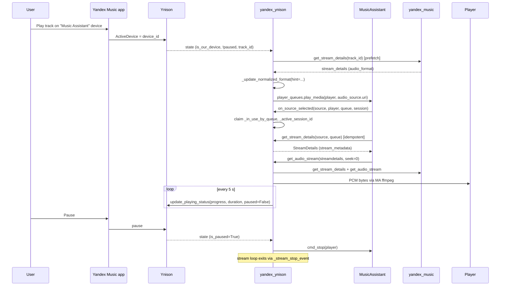

## Problem Statement

When a user picks the "Music Assistant" device in the Yandex Music app
(or activates the plugin from MA's UI), the plugin must start streaming
through whichever MA player is configured, with seek / play / pause /
next / previous controls in the MA UI staying in sync with the Yandex
Music app on the user's phone. Until upstream PR
`music-assistant/server#3938` (merged 2026-05-22), the plugin delivered
this through the `PluginSource` dataclass and a parallel
streaming/metadata/control pipeline. That contract was retired and
replaced by a first-class `AudioSource` MediaItem. The plugin has to
match the new contract end-to-end or it will not load against MA
`>=1.1.120`.

## Solution Summary

Take the upstream `yandex_ynison/provider.py` as the new base (Marcel
migrated it inside #3938) and port our four Ynison-protocol invariants
on top: echo classification by `device_id` AND-logic (queue + status
both authored by us), 2 s post-reconnect settle window, 1 s idempotency
TTL for outbound commands, and a streaming progress clamp to
`duration_ms`. Drop the experimental `handoff` playback mode and the
`enable_ui_integration` fake-queue toggle with no migration shim —
existing settings lose their values silently on upgrade. The plugin
now always advertises `{AUDIO_SOURCE}` and activates playback via
`mass.player_queues.play_media(player_id, str(audio_source.uri))`.

## Acceptance Criteria

1. The plugin advertises `ProviderFeature.AUDIO_SOURCE` unconditionally;
   `get_audio_sources()` returns exactly one `AudioSource` whose `uri`
   is `library://<instance_id>/audio_sources/main`.
2. `get_stream_details(source_id, queue_id)` is side-effect free — calling
   it without a follow-up `get_audio_stream` neither claims the lock
   (`_in_use_by_queue`) nor advances the session id.
3. `get_audio_stream(streamdetails)` captures `_in_use_by_queue` and
   `_active_session_id` at entry and only clears the lock in its
   `finally` when both values still match. A same-queue reconnect that
   has bumped `_active_session_id` mid-stream must not have its claim
   erased by the previous generator's teardown.
4. `on_source_unselected(source_id, queue_id, stream_session_id)` returns
   without touching state when `stream_session_id` differs from the live
   `_active_session_id` (stale callback rejection).
5. Toggling `_yandex_provider` from `None` to a mock and calling
   `_update_source_capabilities()` re-stamps the live
   `queue.current_item.media_item` with a fresh `AudioSource` whose
   `can_play_pause` / `can_seek` / `can_next_previous` flags are `True`,
   and calls `signal_update(queue_id, items_changed=True)`.
6. The four protocol invariants survive the migration:
   - echo classification AND-logic on `device_id` for both queue and
     status blocks;
   - 2 s settle window after a WS reconnect causes
     `_handle_ynison_state` to early-return on the first inbound state;
   - two `_on_pause` calls inside 1 s send exactly one
     `update_playing_status`;
   - `_send_progress_to_ynison(5000, 4000, …)` clamps to
     `progress_ms=4000`.
7. `pre-commit run --all-files`, `uv run pytest`, and `uv run mypy
   provider/` are green on the tip of the branch.

## Test Plan

- `tests/test_provider.py` — upstream-shaped suite (106 tests) plus
  seven invariant test classes (`TestPostReconnectSettleWindow`,
  `TestIdempotencyTTL`, `TestProgressClamp`, `TestDriftClassifier`,
  `TestOnSourceUnselectedStaleRejection`,
  `TestUpdateSourceCapabilitiesStamping`, `TestPrefetchOrdering`).
- `tests/test_ynison_client.py` — preserves the `_classify_state_as_echo`
  AND-logic cases and the `_post_reconnect_settle_until` tests.
- `tests/test_streaming.py` / `tests/test_auth.py` /
  `tests/test_config_entries.py` — pin the no-handoff config shape and
  format helpers.
- Manual end-to-end: select the plugin in MA's "Live Inputs" → play /
  pause / next / prev / seek from both the MA UI and the Yandex Music
  app; drop the WS for 30 s and watch for a `"Skipping state inside
  post-reconnect settle window"` debug log on reconnect; double-tap
  pause and confirm exactly one `update_playing_status` in the WS log;
  trigger a RADIO queue rebuild and confirm playback does not jump back
  to the start.

## Sequence Diagram

## Data Model

**Removed (no migration helper):**

- `PluginSource` dataclass (was at `self._source_details`). Fields
  `id`, `name`, `passive`, `can_play_pause`, `can_seek`,
  `can_next_previous`, `audio_format`, `metadata`, `stream_type`,
  `on_select`, `on_play`, `on_pause`, `on_next`, `on_previous`,
  `on_seek`, `in_use_by` — all consumed by MA via the new
  `AudioSource` MediaItem + lifecycle hooks.
- Config keys: `playback_mode`, `handoff_heartbeat_interval`,
  `enable_ui_integration`.
- Module constants: `PLAYBACK_MODE_STREAM`, `PLAYBACK_MODE_HANDOFF`,
  `HANDOFF_HEARTBEAT_DEFAULT/MIN/MAX`.
- Helper: `_features_for_mode()` in `provider/__init__.py`.
- Test suite: `tests/test_provider_handoff.py`.
- Protocol field: `YandexMusicProviderLike.instance_id` (only used by
  handoff URI building).

**Added:**

- `self._audio_source: AudioSource` — single MediaItem with
  `item_id="main"`, `provider_mappings={ProviderMapping(audio_format=...)}`,
  `exclusive=True`, `allow_external_trigger=True`, capability flags
  driven by `_yandex_provider is not None`.
- `self._stream_metadata: StreamMetadata` — passed via
  `StreamDetails.stream_metadata` on `get_stream_details`, same channel
  ICY radio uses.
- Lock fields: `self._in_use_by_queue: str | None` (queue_id) and
  `self._active_session_id: str | None` (UUID per request from the
  streams controller).
- New module constant: `AUDIO_SOURCE_ID = "main"`.
- Ported invariant fields: `_command_idempotency`,
  `_COMMAND_IDEMPOTENCY_TTL`, `_ECHO_GRACE_PERIOD`,
  `_PREFETCH_FORMAT_TIMEOUT`.
- New helpers: `_idempotent`, `_classify_drift`,
  `_prefetch_format_for_track`, `_build_audio_source`.
- New contract methods: `get_audio_sources`, `get_stream_details`,
  `on_source_control`, `on_source_selected`, `on_source_unselected`.
  `get_audio_stream` signature changes from `(player_id)` to
  `(streamdetails, seek_position=0)` to match `MusicProvider`.

**Changed:**

- `_update_normalized_format` gains an optional `hint: AudioFormat`
  parameter so the auto-mode base can promote to the real source rate
  before any config overrides apply.
- `PCM_LOSSLESS_PARAMS.sample_rate` 44100 → 48000 to match upstream
  baseline. Auto-mode prefetch lifts to the actual source rate, so this
  only affects the no-hint default for lossless when the rate is
  unknown.
- `provider/manifest.json` `"stage": "beta"` stays through `3.0.0b1`;
  flip to `"stable"` when cutting `3.0.0` stable.
