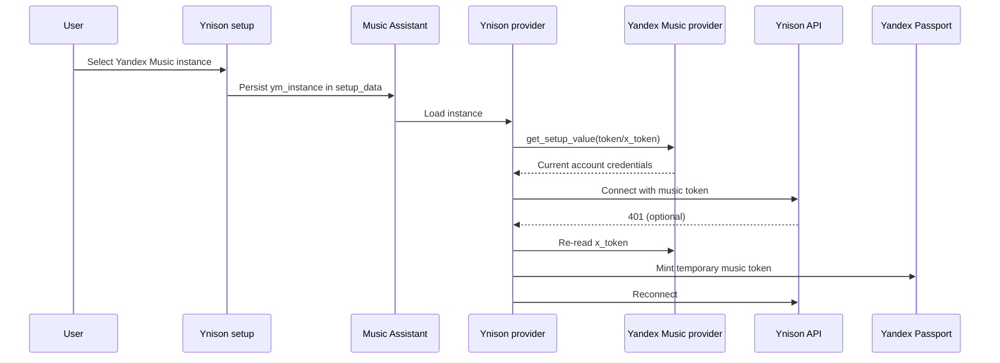

## Problem Statement

Ynison currently has two authentication paths: it can borrow credentials from a
configured Yandex Music provider, or it can own a separate token/session obtained by QR
login or manual token entry. The two paths duplicate account state and stopped following
Music Assistant's setup-data ownership model: current Yandex Music credentials live in
encrypted `setup_data`, while the shared borrow helper still reads ordinary config values.
As a result, linked authentication can resolve empty credentials and own-mode adds a second
account lifecycle that users must maintain.

## Solution Summary

Make every Ynison instance select one configured Yandex Music provider and read that
provider's `token` and `x_token` through its `get_setup_value` API. Remove Ynison QR login,
manual token fields and persistent credentials. Existing own-mode instances fail with an
actionable reconfigure error; reconfiguration selects a Yandex Music instance and nulls
legacy secrets. No compatibility release, automatic secret transfer, Yandex Music change,
or `ya-passport-auth` change is introduced.

## Acceptance Criteria

1. A new Ynison setup cannot finish without selecting a configured Yandex Music provider.
2. Runtime authentication reads `token` and `x_token` only from the selected provider's
   `get_setup_value` method and never writes credentials to either provider.
3. A missing linked provider is treated as temporarily unavailable, while a wrong provider
   type or unusable credentials fail authentication with an actionable error.
4. `ym_instance="__own__"` and missing sources fail immediately and require reconfigure;
   reconfigure never copies the old credentials and persists legacy auth keys as `null`.
5. A rejected music token can be refreshed from the linked provider's `x_token`, using the
   existing in-memory TTL/lock cache, without persisting the minted token.
6. Ynison runtime settings contain playback/output options only; account, target player and
   published device name are owned by the setup flow.
7. Existing playback, stream, handoff and player-selection behavior remains unchanged.

## Test Plan

- Unit-test the linked credential source against setup-data tokens, unloaded/wrong owners,
  missing accessors, empty values and existing `SecretStr` values.
- Unit-test setup and reconfigure flows for zero, one and multiple Yandex Music instances,
  explicit selection, identity prefill and legacy secret nulling.
- Unit-test provider initialization, token resolution, x-token fallback, 401 refresh,
  cache invalidation and legacy own-mode rejection.
- Run the complete pytest, Ruff, mypy and pre-commit suites in the provider's Linux
  development environment.
- Manually create and reconfigure Ynison instances against one and multiple Yandex Music
  accounts in an up-to-date Music Assistant dev server.

## Sequence Diagram

