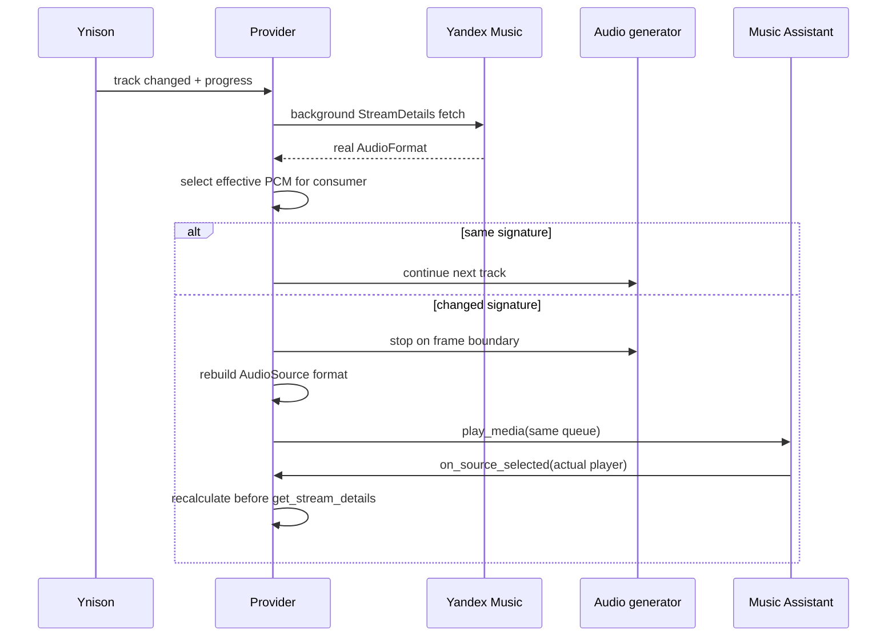

## Problem Statement

The AudioSource currently freezes one PCM format for a complete playback
session. This protects continuity but prevents a mixed-format queue from
preserving the native PCM of every track. Users who prefer maximum fidelity
need an opt-in policy that changes sessions only at real format boundaries.

## Solution Summary

Add a stable-by-default stream mode and an eligible `max_quality_dynamic` mode.
Dynamic playback prefetches real stream details, snaps native PCM sample rate to
the actual consumer capabilities while preserving the source bit depth under
MA's realtime AudioSource contract, continues equal effective formats, and
coordinates a same-queue AudioSource restart when the signature changes.

## Acceptance Criteria

1. Existing and new installations use `stable` unless dynamic mode is selected.
2. Dynamic mode activates only for Superb quality with both output overrides on Auto.
3. Effective PCM supports 8–384 kHz sources and PCM16, PCM24, and PCM32 containers.
4. The policy does not upsample when a supported rate at or below the source exists.
5. Current and immediate-next real StreamDetails are prefetched without blocking state handling.
6. Equal effective PCM signatures continue one session; different signatures issue one restart.
7. A restart ends on a PCM frame boundary and never signals natural track completion.
8. Stale generation work cannot launch after skip, pause, handoff, player switch, or unload.
9. The actual selected player recalculates the signature before MA reads StreamDetails.
10. Logs contain formats, decisions, retries, cancellation, and restart timing without secrets.

## Sequence Diagram

## Data Model

- Runtime config adds `stream_mode`: `stable` or `max_quality_dynamic`.
- Effective PCM is the stable tuple `(content_type, sample_rate, bit_depth, channels)`.
- Coordinator state contains a generation integer, current/next StreamDetails map,
  pending track IDs, one transition task, one next-track prefetch task, and a
  session-ended event.

## Test Plan

- Unit-test the configuration eligibility matrix and one-warning fallback.
- Table-test format selection across common and high-resolution rates/depths.
- Exercise continuation, restart ordering/deduplication, stale generations,
  pause preservation, actual-player recalculation, and false-advance prevention.
- Run pytest, Ruff, mypy, pre-commit, and credential-backed Docker smoke cases.
