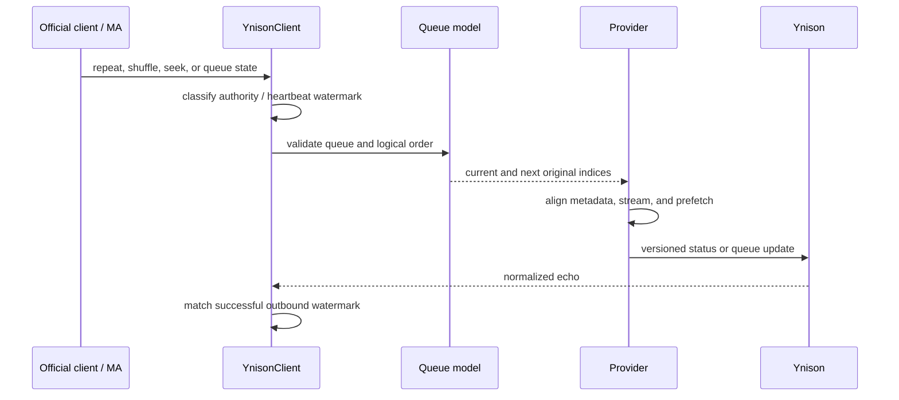

## Problem Statement

Music Assistant currently advances the raw Ynison playable list sequentially. The
official client publishes repeat modes and a separate shuffle index mapping, so
repeat-one advances incorrectly and shuffled metadata, audio, navigation, and queue
edits can disagree. Empty-version progress echoes can also be mistaken for external
seeks at track boundaries.

## Solution Summary

Use recent successful outbound status watermarks to distinguish server-normalized
heartbeats from authoritative client actions, and introduce one validated logical
queue model shared by playback, metadata, navigation, prefetch, repeat, shuffle, and
queue edits. Expose the supported repeat and shuffle controls through the existing
Music Assistant AudioSource contract.

## Acceptance Criteria

1. The disconnect sentinel clears stale ownership only when the active-device field
   is absent; ordinary partial updates preserve ownership.
2. A recent matching empty-version heartbeat is suppressed, while phone-authored
   play, pause, seek, transfer, and queue changes remain observable.
3. A delayed heartbeat cannot roll playback back after a newer authoritative seek.
4. Metadata, streamed audio, next/previous, and prefetch resolve the same logical
   playable with and without shuffle.
5. Invalid shuffle mappings safely fall back to original order.
6. Repeat ONE restarts the current playable at zero on natural completion, while an
   explicit next command advances.
7. Repeat ALL wraps at the logical end and repeat NONE reaches terminal state without
   waiting for an impossible track change.
8. Music Assistant advertises and dispatches repeat and shuffle only while the
   linked Yandex provider is available.
9. RADIO replenishment leaves the queue and active shuffle mapping valid.
10. Incoming add, remove, and move changes keep the current playable, metadata, and
    stream selection coherent.

## Sequence Diagram

## Data Model

- A bounded outbound status watermark records track, progress, duration, paused
  state, monotonic send time, and local ordering generation.
- A queue view retains the original playable list and derives a validated logical
  order from `shuffle_optional.playable_indices`.
- Navigation outcomes distinguish restart-current, advance, wrap, terminal stop,
  and RADIO replenishment.
- Queue edits operate on positions and preserve duplicate playable IDs.

## Test Plan

- Parse sanitized disconnect, heartbeat, seek, repeat, and shuffled-queue fixtures.
- Table-test valid and malformed shuffle mappings, every repeat mode, explicit
  navigation, RADIO append, and edits around the current item.
- Exercise AudioSource capability and control dispatch with strict payload types.
- Verify completion, same-track restart, terminal stop, and heartbeat/seek ordering.
- Run the full automated gate and the official-client/Station live matrix described
  in the implementation plan.
